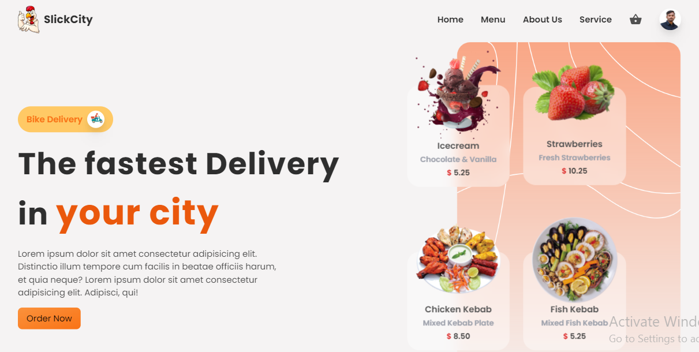

> FullStack Food Delivery Application using React.js
>[Follow US](https://www.instagram.com/rushii_shelke)



# To Cheak the node version
```
node --version
```

# To initialize the firebase console
```
firebase init
```

# To Start the server
```
npm run server
```

# To create react project using npm
```
npm create react-app folder_name
```

# To Start the client
```
npm start
```

> Packages Used

<!-- prettier-ignore -->
| Name                  | Links | Description |
|-----------------------|-------|-------------|
| Reacts                | [React](https://reactjs.org/) | React is a free and open-source front-end JavaScript library for building user interfaces based on UI components. |
| Tailwind CSS | [Tailwindcss](https://tailwindcss.com/ | TailwindCSS is a framework like no other. Rather than constraining you to a set design, it gives you the tools and the standardization to build exactly what you want. |
| Firebase Functions    | [Functions] (https://firebase.google.com/docs/functions) | Cloud Functions for Firebase is a serverless framework that lets you automatically run backend code in response to events triggered by Firebase features. | 
| Express               | [Express](https://express.com/) | Express.js, or simply Express, is a back end web application framework for Node.js, released as free and open-source software under the MIT License. It is designed for building web applications and APIs. |
| React Router Dom      | [ReactRouterDon] (https://reactrouter.com/en/main) | React Router DOM is an now package that enables you to implement dynamic routing in a web app. It allows you to display pades and allow users to navigate them. |
| Framer Motion         | [FramerMotion](https://www.framer.com/motion/) | A production-ready motion Library for React. Utilize the power behind Framer, the best prototyping tool for teams. Proudly open source. | 
| React Icons           | [ReactIcons] (https://react-icons.github.io/react-icons/) | All Popular Icons in single package. |